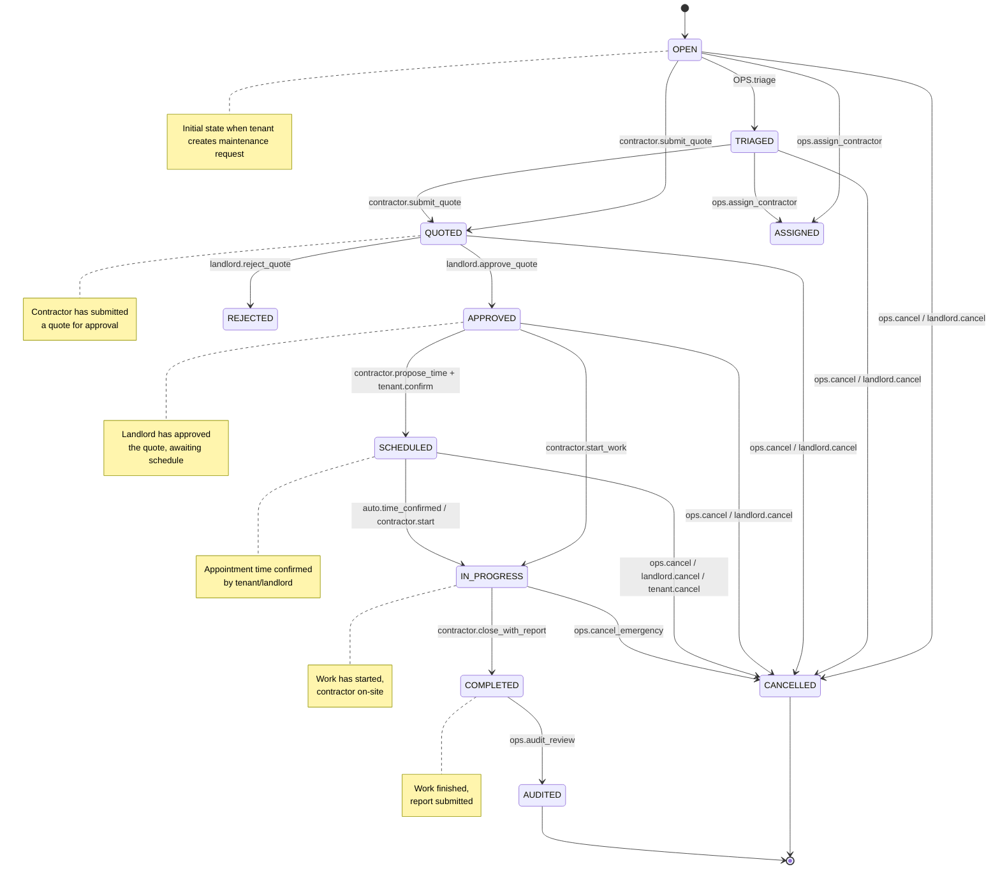

# Ticket Lifecycle and State Management

This document describes the ticket lifecycle state machine and role-based transition rules for the property management platform.

## State Machine Diagram



## Ticket States

### OPEN
- **Description**: Initial state when a maintenance ticket is created by a tenant or landlord
- **Visible to**: Tenant, Landlord, OPS
- **Allowed Actions**:
  - OPS can triage → `TRIAGED`
  - OPS can assign contractor → `ASSIGNED`
  - Contractor can submit quote → `QUOTED`
  - OPS/Landlord can cancel → `CANCELLED`

### TRIAGED
- **Description**: Ticket has been reviewed and categorized by operations team
- **Visible to**: Tenant, Landlord, OPS, Assigned Contractor (if any)
- **Allowed Actions**:
  - OPS can assign contractor → `ASSIGNED`
  - Contractor can submit quote → `QUOTED`
  - OPS/Landlord can cancel → `CANCELLED`

### ASSIGNED
- **Description**: Ticket has been assigned to a contractor but no quote submitted yet
- **Visible to**: Tenant, Landlord, OPS, Assigned Contractor
- **Allowed Actions**:
  - Contractor can submit quote → `QUOTED`
  - OPS can reassign contractor
  - OPS/Landlord can cancel → `CANCELLED`

### QUOTED
- **Description**: Contractor has submitted a quote awaiting landlord approval
- **Visible to**: Tenant, Landlord, OPS, Contractor
- **Allowed Actions**:
  - Landlord can approve quote → `APPROVED`
  - Landlord can reject quote → `REJECTED`
  - OPS/Landlord can cancel → `CANCELLED`

### REJECTED
- **Description**: Quote has been rejected by landlord
- **Visible to**: Tenant, Landlord, OPS, Contractor
- **Allowed Actions**:
  - Contractor can submit new quote → `QUOTED`
  - OPS can reassign to different contractor
  - OPS/Landlord can cancel → `CANCELLED`

### APPROVED
- **Description**: Quote has been approved, awaiting scheduling
- **Visible to**: Tenant, Landlord, OPS, Contractor
- **Allowed Actions**:
  - Contractor can propose appointment time
  - Tenant/Landlord can confirm appointment → `SCHEDULED`
  - Contractor can start work immediately → `IN_PROGRESS`
  - OPS/Landlord can cancel → `CANCELLED`

### SCHEDULED
- **Description**: Appointment time confirmed, work scheduled
- **Visible to**: Tenant, Landlord, OPS, Contractor
- **Allowed Actions**:
  - Auto-transition at appointment time → `IN_PROGRESS`
  - Contractor can start early → `IN_PROGRESS`
  - OPS/Landlord/Tenant can cancel → `CANCELLED`

### IN_PROGRESS
- **Description**: Work is actively being performed
- **Visible to**: Tenant, Landlord, OPS, Contractor
- **Allowed Actions**:
  - Contractor can complete work → `COMPLETED`
  - OPS can cancel (emergency only) → `CANCELLED`

### COMPLETED
- **Description**: Work has been completed, report submitted
- **Visible to**: Tenant, Landlord, OPS, Contractor
- **Allowed Actions**:
  - OPS can audit and finalize → `AUDITED`
  - Tenant can provide feedback

### AUDITED
- **Description**: Final state - ticket has been audited and closed
- **Visible to**: Tenant, Landlord, OPS, Contractor
- **Allowed Actions**: None (terminal state)

### CANCELLED
- **Description**: Ticket was cancelled before completion
- **Visible to**: Tenant, Landlord, OPS, Contractor
- **Allowed Actions**: None (terminal state)

## Role-Based Transition Guards

### Transition Rules by Role

| From State | To State | Allowed Roles | Conditions |
|-----------|---------|---------------|------------|
| OPEN | TRIAGED | OPS | Always allowed |
| OPEN | ASSIGNED | OPS | Contractor must exist |
| OPEN | QUOTED | CONTRACTOR | Must be assigned to ticket |
| OPEN | CANCELLED | OPS, LANDLORD | Always allowed |
| TRIAGED | QUOTED | CONTRACTOR | Must be assigned to ticket |
| TRIAGED | ASSIGNED | OPS | Contractor must exist |
| TRIAGED | CANCELLED | OPS, LANDLORD | Always allowed |
| QUOTED | APPROVED | LANDLORD | Auto-approve if under threshold |
| QUOTED | REJECTED | LANDLORD | Always allowed |
| QUOTED | CANCELLED | OPS, LANDLORD | Always allowed |
| APPROVED | SCHEDULED | CONTRACTOR + (TENANT \|\| LANDLORD) | Requires appointment confirmation |
| APPROVED | IN_PROGRESS | CONTRACTOR | Can skip scheduling |
| APPROVED | CANCELLED | OPS, LANDLORD | Always allowed |
| SCHEDULED | IN_PROGRESS | CONTRACTOR, AUTO | At scheduled time or early start |
| SCHEDULED | CANCELLED | OPS, LANDLORD, TENANT | Always allowed |
| IN_PROGRESS | COMPLETED | CONTRACTOR | Must submit completion report |
| IN_PROGRESS | CANCELLED | OPS | Emergency cancellation only |
| COMPLETED | AUDITED | OPS | Final review complete |

### Auto-Transitions

The system automatically performs certain transitions:

1. **SCHEDULED → IN_PROGRESS**
   - Triggers at the scheduled appointment start time
   - Grace period: 30 minutes
   - If contractor doesn't check in within grace period, status changes to `NO_SHOW`

2. **QUOTED → APPROVED**
   - Auto-approval when quote is under landlord's auto-approve threshold
   - Configured per landlord in `ApprovalRule` table
   - Typically $500 or lower

## Notification Matrix

Events trigger notifications to different roles:

| Event | Notify Roles | Channels |
|-------|-------------|----------|
| ticket.created | LANDLORD, OPS | in-app + email |
| ticket.assigned | CONTRACTOR, TENANT | email + in-app |
| quote.submitted | LANDLORD, OPS | in-app + email |
| quote.approved | CONTRACTOR, TENANT | email + in-app |
| quote.rejected | CONTRACTOR | email + in-app |
| appointment.proposed | TENANT, LANDLORD | in-app |
| appointment.confirmed | CONTRACTOR, LANDLORD, OPS | in-app + email |
| ticket.in_progress | TENANT, LANDLORD | in-app |
| ticket.completed | TENANT, LANDLORD, OPS | email + in-app |
| ticket.cancelled | ALL_INVOLVED | email + in-app |

## Business Rules

### Quote Approval
- Quotes under landlord's threshold are auto-approved
- Quotes above threshold require explicit landlord approval
- Multiple quotes can be submitted for the same ticket
- Only one quote can be in APPROVED state at a time

### Contractor Assignment
- Tickets can be assigned to contractors at any state before COMPLETED
- Reassignment is allowed but creates an audit trail
- Contractors can only see tickets assigned to them

### Cancellation
- OPEN, TRIAGED, QUOTED, APPROVED, SCHEDULED tickets can be cancelled
- IN_PROGRESS tickets can only be cancelled by OPS (emergency)
- Cancellation reason must be provided
- Cancelled tickets cannot be reopened

### Scheduling
- Appointments must be proposed by contractor
- Confirmation required from tenant or landlord
- Multiple appointment proposals allowed
- Only one appointment can be CONFIRMED at a time

## API Examples

### Transition a Ticket Status
```http
PATCH /api/tickets/{ticketId}/status
Authorization: Bearer {token}
Content-Type: application/json

{
  "to": "APPROVED"
}
```

### Bulk Operations (OPS Only)
```http
POST /api/tickets/bulk/assign
Authorization: Bearer {token}
Idempotency-Key: {unique-key}
Content-Type: application/json

{
  "ticket_ids": ["t1", "t2", "t3"],
  "contractor_id": "c1"
}
```

Response:
```json
{
  "ok": ["t1", "t2"],
  "failed": [
    { "id": "t3", "error": "Already closed" }
  ]
}
```

### Search and Filter Tickets
```http
GET /api/tickets?q=leak&category=plumbing&status=OPEN&page=1&page_size=25&sort_by=created_at&sort_dir=desc
Authorization: Bearer {token}
```

Response:
```json
{
  "items": [...],
  "page": 1,
  "page_size": 25,
  "total": 145,
  "has_next": true
}
```

## Error Handling

### Invalid Transitions
```json
{
  "code": "INVALID_TRANSITION",
  "message": "Cannot transition from COMPLETED to OPEN",
  "details": {
    "currentState": "COMPLETED",
    "requestedState": "OPEN",
    "allowedStates": []
  }
}
```

### Permission Denied
```json
{
  "code": "FORBIDDEN",
  "message": "Only OPS role can perform bulk operations",
  "details": {
    "requiredRole": "OPS",
    "userRole": "LANDLORD"
  }
}
```

## Audit Trail

All state transitions are recorded in the `TicketTimeline` table with:
- Event type
- Actor (user who performed the action)
- Timestamp
- Details (JSON payload with context)
- Old and new states

This ensures complete traceability of ticket lifecycle changes.
